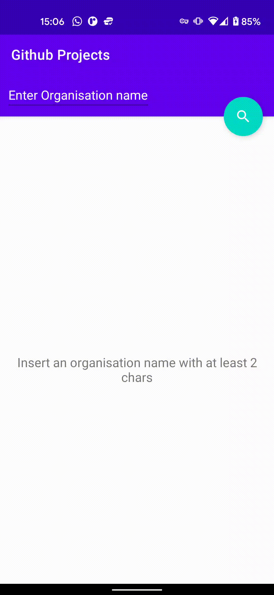

# Lp-to-Dp-app
Example App with a List Page and a Detail Page

For this example I used Github APIs: `/orgs/{organisation}/repos` for the list page and `/repos/{owner}/{repository}` for the detail page.

Some notes:
* Code strictly follows SOLID and Clean Architecture principles
* Code has been written after the tests in a pure TDD fashion
* Tests have been written without the use of Mocking libraries since it is easy to create fakes when each unit depends on an abstract collaborator (as per DIP).
* For the DI framework I used Dagger Hilt since it is the recommended way from Google, although I didn't use `@Inject` in class constructors because I consider it a coupling with the DI framework.
* I used Coroutines as Asyncrhronous framework since this is the new recommeded way, I am a huge RxJava fan tho.

How the app works:

